# Module 6 EDA - GUI Mermaid Diagrams

> Auto-generated: 2026-01-30
> Source: Codebase analysis - module6-eda/pkg/gui/

## Quick Reference

| Diagram | Purpose | Description |
|---------|---------|-------------|
| Application Architecture | High-level entry points | Standalone vs Unified app modes |
| Component Hierarchy | Widget tree structure | Full layout and nesting |
| Builder Tab Layout | Configuration and generation | Cell config, array config, actions |
| Preview Tab Structure | Output visualization | Verilog, DEF, Layout images |
| Validation Tab Structure | Result display | Status indicators and logs |
| Generate All Flow | Sequence of generation steps | LEF/LIB/V/DEF/PNG creation |
| Validate All Flow | Validation sequence | Yosys, DEF, Cross-check, OpenLane |
| Threading Model | Goroutine architecture | Main thread + background workers |
| State Management | Data flow and callbacks | Entry → Stats → Updates |

## 1. Application Architecture

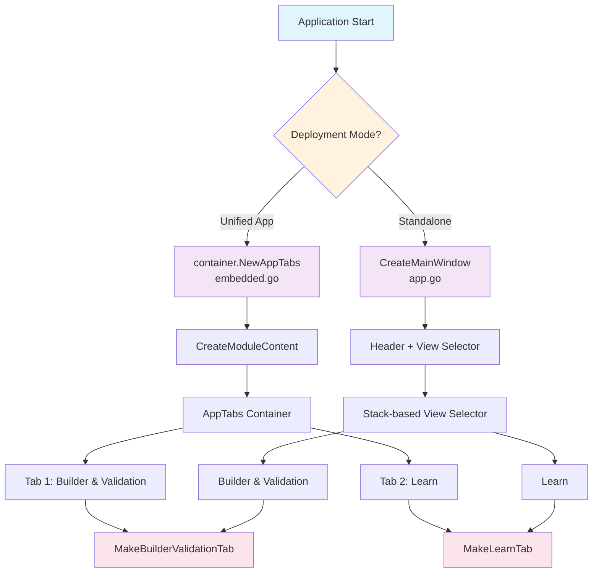

## 2. Builder & Validation Tab - Full Component Tree

```mermaid
graph TD
    BuilderTab["MakeBuilderValidationTab<br/>Main Container"] --> MainContent["MainContent<br/>BorderContainer"]

    MainContent --> TopSection["TopSection<br/>VBox"]
    MainContent --> MainSplit["MainSplit<br/>VSplit 75/25"]

    TopSection --> ConfigSplit["ConfigSplit<br/>HSplit 45/55"]
    TopSection --> ActionRow["ActionRow<br/>HBox"]
    TopSection --> StatusRow["StatusRow<br/>HBox"]

    ConfigSplit --> CellPanel["Cell Config Panel<br/>VBox"]
    ConfigSplit --> ArrayPanel["Array Config Panel<br/>VBox"]

    CellPanel --> CellGrid1["GridWithColumns 6<br/>Name, W, H, Rise, Fall, Cap"]
    CellPanel --> CellGrid2["GridWithColumns 4<br/>Leakage, CellArea"]

    ArrayPanel --> ArrayGrid["GridWithColumns 6<br/>Rows, Cols, Mode"]
    ArrayPanel --> ArchToggle["GridWithColumns 3<br/>PASSIVE | 1T1R | 2T1R"]
    ArrayPanel --> ModeHelp["Mode Help Text"]
    ArrayPanel --> StatsRow["HBox Stats"]

    StatsRow --> Stats["Total, Area, WL, BL, Density, Util"]

    ActionRow --> GenBtn["Generate All"]
    ActionRow --> ValBtn["Validate All"]
    ActionRow --> ExpBtn["Export Package"]

    StatusRow --> Status["Status Label"]

    MainSplit --> PreviewTabs["Preview AppTabs"]
    MainSplit --> ValidationSection["Validation VBox"]

    PreviewTabs --> VTab["Verilog Tab"]
    PreviewTabs --> DTab["DEF Tab"]
    PreviewTabs --> LTab["Layout Tab"]

    VTab --> VerilogPreview["MultiLineEntry Preview"]
    VTab --> VerilogStats["Stats Label"]

    DTab --> DEFPreview["MultiLineEntry Preview"]
    DTab --> DEFStats["Stats Label"]

    LTab --> LayoutHelp["Help Text + Buttons"]
    LTab --> LayoutStack["GridWithColumns 3<br/>KLayout, OpenROAD, Yosys"]

    ValidationSection --> ValidationRow["HBox Results"]
    ValidationSection --> OpenLaneRow["HBox Status"]
    ValidationSection --> LogHeader["Log Header + Clear"]
    ValidationSection --> LogScroll["Log Output"]

    ValidationRow --> YosysResult["Label Result"]
    ValidationRow --> DEFResult["Label Result"]
    ValidationRow --> CrossResult["Label Result"]
    ValidationRow --> PlacementResult["Label Result"]

    OpenLaneRow --> DockerStatus["Docker Status"]
    OpenLaneRow --> PDKStatus["PDK Status"]
    OpenLaneRow --> PullImageBtn["Pull Button"]

    style BuilderTab fill:#b3e5fc
    style CellPanel fill:#fff9c4
    style ArrayPanel fill:#fff9c4
    style PreviewTabs fill:#e1bee7
    style ValidationSection fill:#ffccbc
```

## 3. Builder Tab - Cell Configuration Panel

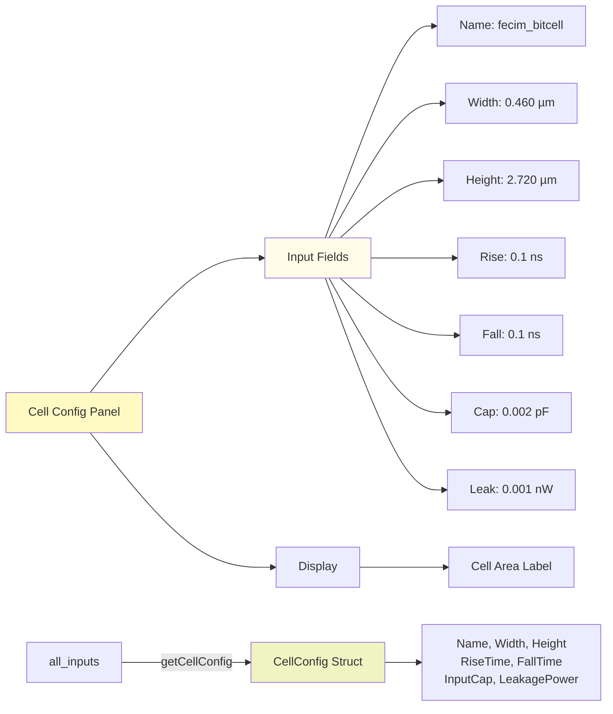

## 4. Builder Tab - Array Configuration Panel

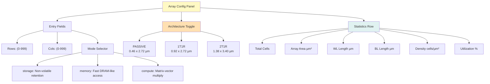

## 5. Architecture Button State Machine

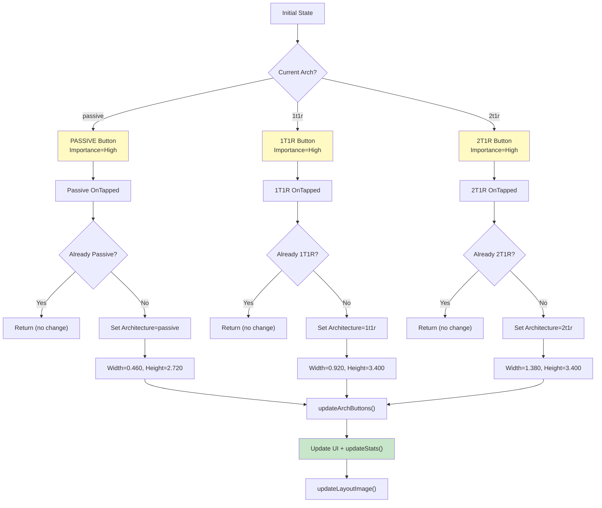

## 6. Preview Tabs - Three-Column Layout

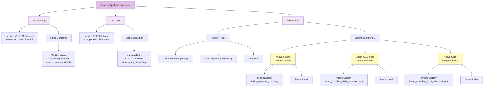

## 7. Generate All - Data Flow Sequence

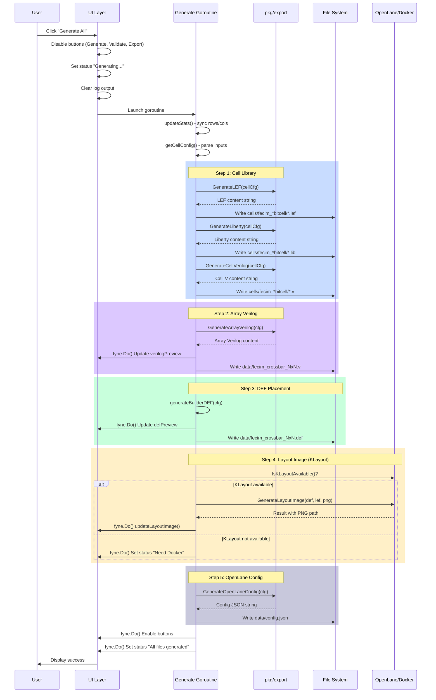

## 8. Validate All - Validation Sequence

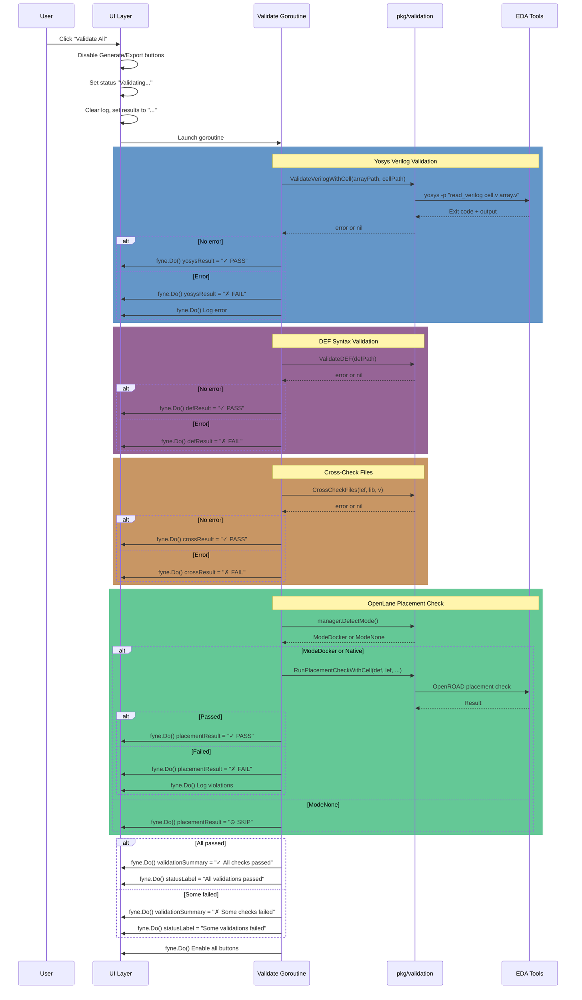

## 9. Threading Model & fyne.Do Pattern

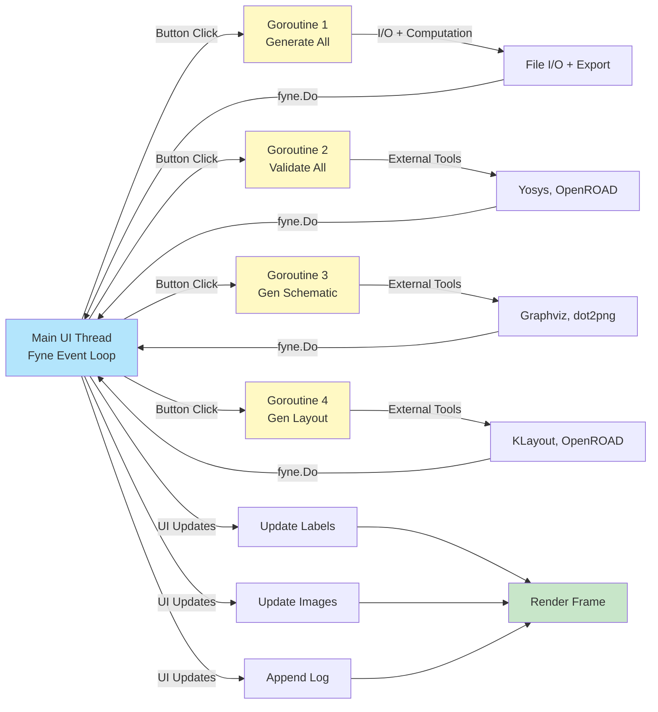

## 10. Entry Field Change Handlers

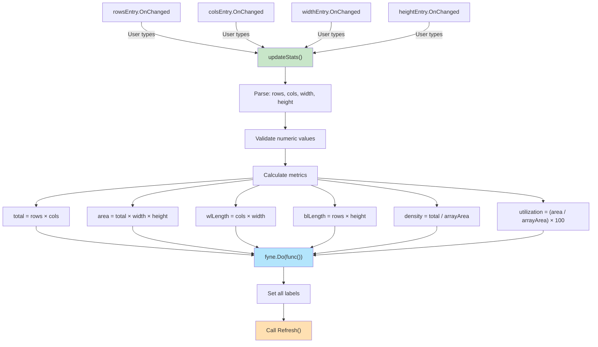

## 11. Learn Tab - Component Structure

```mermaid
graph TD
    LearnTab["MakeLearnTab"] --> Header["Header VBox"]
    LearnTab --> Content["Content BorderContainer"]

    Header --> Title["FeCIM Array Builder<br/>Learning Center"]
    Header --> Subtitle["Understanding OpenLane..."]
    Header --> Sep["Separator"]

    Content --> Split["HSplit 25/75"]

    Split --> Sidebar["Sidebar (25%)"]
    Split --> ContentScroll["Content Scroll (75%)"]

    Sidebar --> SidebarTitle["Topics (title)"]
    Sidebar --> TopicList["List Widget"]

    TopicList --> T0["1. What is FeCIM EDA?"]
    TopicList --> T1["2. The Crossbar Architecture"]
    TopicList --> T2["3. EDA Files We Generate"]

    ContentScroll --> DynamicContent["Dynamic Content<br/>VBox (changes on selection)"]

    T0 -->|OnSelected| IntroContent["Intro Content"]
    T1 -->|OnSelected| CrossbarContent["Crossbar Content"]
    T2 -->|OnSelected| FilesContent["Files Content"]

    IntroContent --> IntroTitle["What is FeCIM EDA?"]
    IntroContent --> IntroText["Explanation text"]
    IntroContent --> OperationModes["OperationModesVisual()"]
    IntroContent --> OpenLaneFlow["OpenLaneFlowDiagram()"]
    IntroContent --> StagesExplained["The Stages Explained"]
    IntroContent --> DoColumns["Do/Don't Lists"]
    IntroContent --> DisclaimerCard["Disclaimer Banner"]

    CrossbarContent --> PassiveSection["Passive Crossbar"]
    CrossbarContent --> OneToneRSection["1T1R Section"]
    CrossbarContent --> ComparisonTable["Cell Comparison Table"]
    CrossbarContent --> SneakPathExplain["Sneak Path Explanation"]
    CrossbarContent --> RecommendCard["Recommendation Card"]

    FilesContent --> FileTitle["EDA Files We Generate"]
    FilesContent --> FileCards["4-card Grid<br/>LEF, DEF, Verilog, Liberty"]
    FilesContent --> GenSection["How We Generate Files"]
    FilesContent --> ValSection["How We Validate"]
    FilesContent --> ImgSection["Layout Visualization"]
    FilesContent --> PurposesSection["File Format Summary"]
    FilesContent --> ReferencesSection["References"]

    style LearnTab fill:#b3e5fc
    style Sidebar fill:#f0f4c3
    style ContentScroll fill:#e1bee7
    style T0 fill:#fff9c4
    style T1 fill:#fff9c4
    style T2 fill:#fff9c4
```

## 12. Learn Tab - Topic 1: Intro Content Structure

```mermaid
graph TD
    IntroContent["Intro Content VBox"] --> T0["Title: What is FeCIM EDA?"]
    IntroContent --> Sep1["Separator"]
    IntroContent --> Intro["Intro Paragraph<br/>Array builder explanation"]
    IntroContent --> Sep2["Separator"]

    IntroContent --> OperModes["OperationModesVisual()"]
    OperModes --> OMShowBox["Shows 3 modes side-by-side<br/>storage, memory, compute"]

    IntroContent --> Sep3["Separator"]

    IntroContent --> Flow["OpenLaneFlowDiagram()"]
    Flow --> FlowShow["RTL → Synthesis → Floorplan<br/>→ Placement → CTS → Routing → Signoff"]

    IntroContent --> Sep4["Separator"]

    IntroContent --> Stages["The Stages Explained"]
    Stages --> S1["1. SYNTHESIS: Yosys conversion"]
    Stages --> S2["2. FLOORPLAN: Die area definition"]
    Stages --> S3["3. PLACEMENT: X,Y assignment"]
    Stages --> S4["4. CTS: Clock tree"]
    Stages --> S5["5. ROUTING: Metal wires"]
    Stages --> S6["6. SIGNOFF: GDSII assembly"]

    IntroContent --> Sep5["Separator"]

    IntroContent --> DoColumns["2-column Grid"]
    DoColumns --> DoList["WHAT WE DO:<br/>LEF, LIB, V, DEF, Config"]
    DoColumns --> DontList["WHAT WE DON'T DO:<br/>No FeFET models, no GDSII,<br/>no timing characterization"]

    IntroContent --> Sep6["Separator"]

    IntroContent --> Disclaimer["Disclaimer Card<br/>No affiliation with Rice/Tour"]

    style IntroContent fill:#e1bee7
    style OperModes fill:#fff9c4
    style Flow fill:#fff9c4
    style Stages fill:#fff9c4
    style DoList fill:#fff9c4
    style DontList fill:#fff9c4
```

## 13. Learn Tab - Topic 2: Crossbar Content Structure

```mermaid
graph TD
    CrossbarContent["Crossbar Content VBox"] --> Title["The Crossbar Architecture"]
    CrossbarContent --> Sep1["Separator"]

    CrossbarContent --> PassiveSec["Passive Crossbar Section"]
    PassiveSec --> PassiveTitle["Passive Crossbar"]
    PassiveSec --> PassiveDesc["Description + Pros/Cons"]
    PassiveSec --> PassiveDiag["IsometricCrossbar(3,3,true)"]

    CrossbarContent --> Sep2["Separator"]

    CrossbarContent --> OneToneRSec["1T1R Section"]
    OneToneRSec --> OneToneRTitle["1T1R Crossbar"]
    OneToneRSec --> OneToneRDesc["Description + Pros/Cons"]
    OneToneRSec --> OneToneRDiag["Isometric1T1RCrossbar(3,3)"]

    CrossbarContent --> Sep3["Separator"]

    CrossbarContent --> CompTable["CellComparisonTable()"]
    CompTable --> TableShow["Rows: Passive, 1T1R, 2T1R<br/>Columns: Size, Cost, Scaling"]

    CrossbarContent --> Sep4["Separator"]

    CrossbarContent --> SneakPath["Sneak Path Problem"]
    SneakPath --> SneakDesc["Detailed explanation<br/>with current flow example"]

    CrossbarContent --> Sep5["Separator"]

    CrossbarContent --> Recommend["Recommendation Card"]
    Recommend --> RecText["<= 16x16: Passive<br/>32x32: Either<br/>>= 64x64: 1T1R required"]

    style CrossbarContent fill:#e1bee7
    style PassiveSec fill:#fff9c4
    style OneToneRSec fill:#fff9c4
    style CompTable fill:#fff9c4
    style SneakPath fill:#fff9c4
```

## 14. Learn Tab - Topic 3: Files Content Structure

```mermaid
graph TD
    FilesContent["Files Content VBox"] --> Title["EDA Files We Generate"]
    FilesContent --> Sep1["Separator"]

    FilesContent --> Cards["AdaptiveGrid 2"]
    Cards --> LEFCard["LEFPreviewCard()"]
    Cards --> DEFCard["DEFPreviewCard()"]
    Cards --> VCard["VerilogPreviewCard()"]
    Cards --> LibCard["LibertyPreviewCard()"]

    FilesContent --> Sep2["Separator"]

    FilesContent --> GenTitle["1. How We Generate Files"]
    GenTitle --> GenText["Verilog: Loop rows×cols, instantiate cells<br/>DEF: Calculate area, place cells<br/>LEF: Define geometry"]

    FilesContent --> Sep3["Separator"]

    FilesContent --> ValTitle["2. How We Validate"]
    ValTitle --> ValText["Yosys: read_verilog check<br/>DEF: syntax + structure<br/>Cross: pin name matching<br/>OpenLane: placement check"]

    FilesContent --> Sep4["Separator"]

    FilesContent --> ImgTitle["3. Layout Visualization"]
    ImgTitle --> ImgText["KLayout via Docker<br/>Magic via OpenROAD<br/>Manual tools supported"]

    FilesContent --> Sep5["Separator"]

    FilesContent --> PurpTitle["4. File Format Summary"]
    PurpTitle --> PurpText["LEF: geometry abstract<br/>DEF: placement<br/>V: netlist<br/>LIB: timing (placeholders!)"]

    FilesContent --> Sep6["Separator"]

    FilesContent --> RefTitle["References"]
    FilesContent --> RefCard["ReferencesCard()"]

    style FilesContent fill:#e1bee7
    style Cards fill:#fff9c4
    style GenText fill:#fffde7
    style ValText fill:#fffde7
    style ImgText fill:#fffde7
```

## 15. Widget Inventory - Complete Count

| Component Type | Widget Type | Count | Purpose | Notes |
|---|---|---|---|---|
| **Text Input** | Entry | 9 | Cell config, array config | Parse and validate |
| **Selection** | Select | 1 | Mode (storage/memory/compute) | UpdateModeHelp callback |
| **Toggle Buttons** | Button | 3 | Architecture (PASSIVE/1T1R/2T1R) | State tracking via Importance |
| **Action Buttons** | Button | 6 | Generate, Validate, Export, Gen Schematic, Gen Layout, Clear Log | Disable/Enable on state |
| **Status/Display** | Label | 20+ | Status, stats, results, help text | Dynamic updates via fyne.Do |
| **Containers** | HSplit, VSplit | 2 | Config layout, preview/validation split | Resizable 45/55, 75/25 |
| **Containers** | HBox, VBox | 15+ | Rows and columns throughout | Layout management |
| **Containers** | GridWithColumns | 4+ | Cell config (6), Array config (6), Architecture (3) | Compact grid layout |
| **Text Display** | MultiLineEntry | 3 | Verilog preview, DEF preview, Log output | Monospace, read-only |
| **Images** | canvas.Image | 3 | KLayout, OpenROAD, Yosys schematics | 400x350 each |
| **Cards** | widget.Card | 3 | Image containers, disclaimer, recommendation | Header + content |
| **Tabs** | AppTabs | 2 | Builder, Learn | TabLocation=Top |
| **Scroll** | Scroll | 5+ | Preview content, log, Learn content | Dynamic sizing |

## 16. Data Flow - Config Object Lifecycle

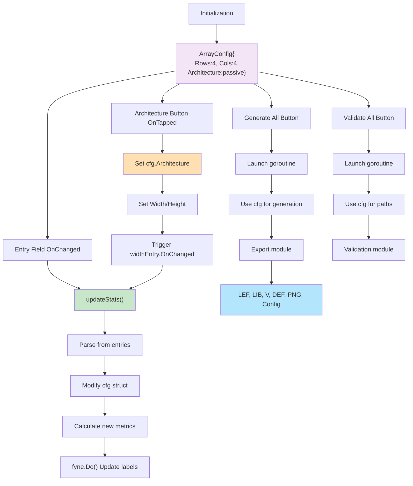

## 17. Error Handling & User Feedback

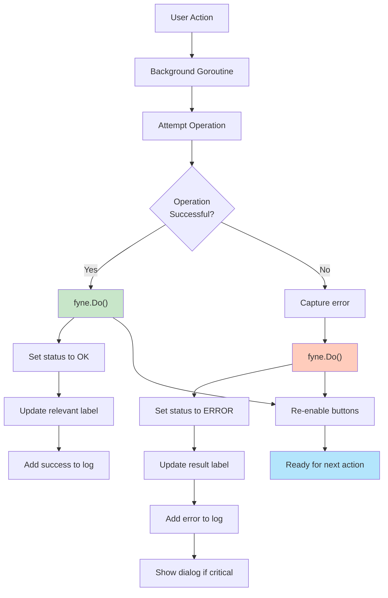

## 18. File Structure on Disk (After Generate All)

```mermaid
graph TD
    ProjectRoot["Project Root"] --> CellsDir["cells/"]
    ProjectRoot --> DataDir["data/"]

    CellsDir --> PassiveCell["fecim_bitcell/ (or 1t1r/2t1r)"]
    PassiveCell --> CellLEF["fecim_bitcell.lef"]
    PassiveCell --> CellLIB["fecim_bitcell.lib"]
    PassiveCell --> CellV["fecim_bitcell.v"]

    DataDir --> ArrayV["fecim_crossbar_NxN.v"]
    DataDir --> ArrayDEF["fecim_crossbar_NxN.def"]
    DataDir --> ArrayPNG["fecim_crossbar_NxN.png"]
    DataDir --> ArrayDOT["fecim_crossbar_NxN_schematic.dot"]
    DataDir --> ArraySchemPNG["fecim_crossbar_NxN_schematic.png"]
    DataDir --> ArrayOpenROADPNG["fecim_crossbar_NxN_openroad.png"]
    DataDir --> ConfigJSON["config.json"]
    DataDir --> ExportDir["fecim_crossbar_NxN/"]

    ExportDir --> ExportCells["cells/ (copy)"]
    ExportDir --> ExportV["fecim_crossbar_NxN.v"]
    ExportDir --> ExportDEF["fecim_crossbar_NxN.def"]
    ExportDir --> ExportJSON["fecim_crossbar_NxN.json"]
    ExportDir --> ExportConfig["config.json"]
    ExportDir --> ExportREADME["README.md"]

    style CellLEF fill:#fff9c4
    style ArrayV fill:#fff9c4
    style ArrayDEF fill:#fff9c4
    style ConfigJSON fill:#ffe0b2
```

## Related Documentation

- **Main Architecture**: `<local-path>`
- **Source Code**:
  - `<local-path>` - Standalone app entry
  - `<local-path>` - Unified app integration
  - `<local-path>` - Builder tab (1286 lines)
  - `<local-path>` - Learn tab
  - `<local-path>` - Visual components
- **Export Module**: `<local-path>`
- **Validation Module**: `<local-path>`

## Key Implementation Details

### Threading Safety
All UI updates use `fyne.Do(func() { ... })` to marshal operations back to main thread:
- Entry label updates
- Image display updates
- Button enable/disable
- Status and log output

### State Management Pattern
1. Entry fields trigger `OnChanged` callbacks
2. `updateStats()` parses and validates all entries
3. Metrics calculated in background (no blocking)
4. UI updated via `fyne.Do()` within goroutine
5. Buttons disabled during long operations

### Architecture Selection Flow
- Three toggle buttons (PASSIVE, 1T1R, 2T1R)
- Button `Importance` property shows selection (High=selected)
- Selecting architecture auto-updates cell dimensions
- Dimensions update triggers statistics recalculation
- All changes propagate through entry OnChanged callbacks

### Error Resilience
- File I/O errors caught and logged
- Invalid numeric entries fall back to current/default values
- Missing files handled gracefully (status shows reason)
- Docker/OpenLane detection non-blocking
- Validation continues even if individual checks fail
