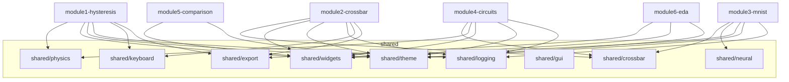

# Shared Refactor Plan — Single Source of Truth

> Make `shared/` the **only** source of truth for all reusable code.
> Every module (1–6) should **import from `shared/`** — never from another module.

---

## Current State (Analysis Summary)

| Metric | Value |
|:---|:---|
| Go module | `fecim-lattice-tools` (single `go.mod`) |
| Modules | 7 (`module1-hysteresis` … `module7-docs`) |
| `shared/` packages | 23 subdirectories, 361+ files |
| Shared tests | 174 test files |

### Cross-Module Dependencies (Must Eliminate)

| Consumer | Imports from | Files affected |
|:---|:---|:---|
| **module3-mnist** | `module2-crossbar/pkg/crossbar` | **12 files** (gui, training, core, cmd) |
| **module4-circuits** | `module2-crossbar/pkg/crossbar` | **1 file** (`app.go` — `WriteDisturbEngine`) |
| module5-comparison | *(none found)* | — |

### Duplicated Files Across Modules

| File | Modules with copies | Shared version exists? |
|:---|:---|:---|
| `embedded.go` | **All 7** (M1–M7) | ❌ No |
| `keyboard.go` | **6** (M1–M6) | ✅ `shared/keyboard/` |
| `export.go` | **5** (M1, M3, M4, M5 + cmd) | ✅ `shared/export/` |
| `liveslide.go` | **3** (M2, M3, M5) | ❌ No (but `shared/widgets` has components) |
| `tooltips.go` | **2** (M2, M4) | ✅ `shared/widgets/tooltips.go` |
| `preset_provider.go` | **2** (M1, M2) | ❌ No |

### Local Widget Variants (Should Use `shared/widgets`)

Each module defines its own `ModeIndicator`, `EducationalPanel`, `OperationLog`, `KeyStat`:

| Widget | M1 | M2 | M3 | M4 | M5 | Shared |
|:---|:---|:---|:---|:---|:---|:---|
| ModeIndicator | local enums | `ModeIndicatorBox` | `MNISTModeIndicator` | — | — | `shared/widgets/mode_indicator.go` ✅ |
| EducationalPanel | slide labels | `*EducationalPanel` | `MNISTEducationalPanel` | — | — | `shared/widgets/educational_panel.go` ✅ |
| OperationLog | log labels | `*OperationLog` | `MNISTOperationLog` | — | — | `shared/widgets/operation_log.go` ✅ |
| KeyStat | — | `*KeyStatBox` | `MNISTKeyStat` | — | — | `shared/widgets/key_stat.go` ✅ |
| StatusBar | custom | shared | shared | — | — | `shared/widgets/status_helper.go` ✅ |

> M2 and M3 still define local wrappers instead of using shared.

---

## Refactoring Phases

### Phase 0 — Crossbar to Shared (Critical Path)

**Why first?** Module 3 (12 files) and Module 4 (1 file) import `module2-crossbar/pkg/crossbar` directly. This **cross-module dependency** must be broken before anything else.

`shared/crossbar/` exists but is effectively empty (only a `logs/` dir).

#### Steps

1. **Copy** `module2-crossbar/pkg/crossbar/*.go` → `shared/crossbar/`
   - 18 source files: `array.go`, `enhanced.go`, `irdrop.go`, `solver.go`, `solver_optimized.go`, `sneakpath.go`, `sneak_multihop.go`, `nonidealities.go`, `nonlinear_iv.go`, `drift.go`, `drift_calibration.go`, `fecap.go`, `temperature.go`, `temperature_profile.go`, `device_errors.go`, `write_disturb.go`, `demo_logging.go`, `gpu_mvm.go`
   - 65 test files
2. **Update package declaration** to `package crossbar` (should stay the same).
3. **Update all imports** project-wide:
   - Find: `"fecim-lattice-tools/module2-crossbar/pkg/crossbar"`
   - Replace: `"fecim-lattice-tools/shared/crossbar"`
4. **Verify**: `make test-xbar && make test-mnist && make test-circuits`
5. **Delete** `module2-crossbar/pkg/crossbar/` after all tests pass.
6. **Update** `module2-crossbar/pkg/gui/` imports to point to `shared/crossbar`.

---

### Phase 1 — GUI Embedded Apps (All Modules)

Every module has an `embedded.go` that wraps the GUI `App` for the launcher. These should follow a shared interface.

#### Steps

1. **Create** `shared/gui/embedded_interface.go` with:
   ```go
   type EmbeddedApp interface {
       CreateEmbeddedContent() fyne.CanvasObject
       Name() string
       Icon() fyne.Resource
   }
   ```
2. **Refactor** each module's `embedded.go` to implement this interface.
3. **Move** common boilerplate (window setup, theme init) to `shared/gui/app_shell.go`.

---

### Phase 2 — Keyboard Shortcuts

6 modules have local `keyboard.go`. `shared/keyboard/keyboard.go` already exists.

#### Steps

1. **Audit** each module's keyboard handling for module-specific vs generic shortcuts.
2. **Extract** common shortcuts (?, Ctrl+E, Ctrl+Z, Escape) into `shared/keyboard/`.
3. **Update** modules to call `shared/keyboard.RegisterCommonShortcuts(window, handlers)`.
4. **Keep** module-specific shortcuts (e.g., M1's waveform toggles) in the module.

---

### Phase 3 — LiveSlide & Widget Consolidation

Modules 2, 3, and 5 have local `liveslide.go`. Modules 2 and 3 define local `ModeIndicator`, `EducationalPanel`, `OperationLog`, `KeyStat` wrappers.

#### Steps

1. **Delete** local `ModeIndicatorBox`, `EducationalPanel`, `OperationLog`, `KeyStatBox` from M2.
   - Replace with imports from `shared/widgets`.
2. **Delete** `MNISTModeIndicator`, `MNISTEducationalPanel`, `MNISTOperationLog`, `MNISTKeyStat` from M3.
   - Replace with imports from `shared/widgets`.
3. **Move** `liveslide.go` logic into `shared/widgets/liveslide.go` (create if not present).
4. **Verify**: `make test-xbar && make test-mnist`

---

### Phase 4 — Export Consolidation

5 modules have local `export.go`. `shared/export/export.go` already exists.

#### Steps

1. **Audit** each module's `export.go` for format-specific vs generic logic.
2. **Move** generic export utilities (CSV, JSON, image export) into `shared/export/`.
3. **Keep** module-specific export formats (e.g., SPICE netlist in M4) in the module.
4. **Update** modules to call `shared/export` for common operations.

---

### Phase 5 — Tooltips

M2 and M4 have local `tooltips.go`. `shared/widgets/tooltips.go` already exists (50KB, comprehensive).

#### Steps

1. **Move** module-specific tooltip content from M2/M4 into `shared/widgets/tooltips.go` (or a `shared/widgets/tooltip_content.go` registry).
2. **Delete** local `tooltips.go` from M2 and M4.
3. **Modules** register their tooltips at startup using a shared `RegisterTooltips()` API.

---

### Phase 6 — Preset Provider

M1 and M2 have local `preset_provider.go`. `shared/presets/` already exists.

#### Steps

1. **Move** preset provider logic to `shared/presets/provider.go`.
2. **Update** M1 and M2 to import from `shared/presets`.

---

### Phase 7 — Ferroelectric/Algorithm Core (Module 1 → Shared)

Module 1 has domain-specific packages that are already partially shared via `shared/physics/`.

#### Current assets

- `module1/pkg/ferroelectric/`: `material.go`, `preisach.go`, `level_bins.go`, `render.go` — Material definitions and Preisach model
- `module1/pkg/algo/`: `calibration.go`, `doc.go` — Calibration manager
- `shared/physics/`: 101 files including `landau.go`, `ispp.go`, `material.go`, `calibration.go`

#### Steps

1. **Audit** overlap between `module1/pkg/ferroelectric/material.go` and `shared/physics/material.go`.
2. **Unify** material definitions into `shared/physics/material.go` (single source).
3. **Move** `preisach.go` to `shared/physics/preisach.go` if it doesn't already exist there.
4. **Move** `module1/pkg/algo/calibration.go` to `shared/physics/calibration.go` (or merge with existing).
5. **Update** M1 imports. **Delete** originals.

---

### Phase 8 — Neural Network Core (Module 3 → Shared)

Module 3 has core neural network logic that could serve future modules.

#### Current assets

- `module3/pkg/core/`: 12 files — `network.go`, `quantize.go`, `energy_model.go`, `cim_physics.go`, `interfaces.go`, `constants.go`, etc.
- `module3/pkg/training/`: `network.go`, `trainer`, `single_layer.go`
- `module3/pkg/mnist/`: Data loader

#### Steps

1. **Create** `shared/neural/` — Move `module3/pkg/core/*.go` here.
2. **Create** `shared/neural/training/` — Move reusable training logic.
3. **Keep** `module3/pkg/mnist/` in the module (MNIST-specific data loading).
4. **Update** M3 imports. **Verify**: `make test-mnist`

---

## Dependency Graph After Refactoring



> **Rule**: Arrows only point into `shared/`. No module imports from another module.

---

## Execution Order (Priority)

| # | Phase | Risk | Impact | Effort |
|:---|:---|:---|:---|:---|
| 0 | Crossbar → shared | **High** (18 files + 65 tests) | **Critical** — breaks M3→M2 dependency | ~2h |
| 1 | Embedded interface | Low | Medium | ~1h |
| 2 | Keyboard | Low | Low | ~30m |
| 3 | LiveSlide + Widgets | Medium (API changes) | High (3 modules) | ~2h |
| 4 | Export | Low | Medium | ~1h |
| 5 | Tooltips | Low | Low | ~30m |
| 6 | Presets | Low | Low | ~20m |
| 7 | Ferroelectric core | Medium (physics overlap) | Medium | ~2h |
| 8 | Neural core | Medium | Medium | ~1.5h |

---

## Verification Plan

### Automated Tests

After each phase:

```bash
# Phase 0
make test-shared && make test-xbar && make test-mnist && make test-circuits

# Phase 1-6
make build && make test

# Phase 7
make test-shared && make test-hys

# Phase 8
make test-shared && make test-mnist

# Final
make test-race
```

### Build Verification

```bash
go build ./...
go vet ./...
```

### Manual Verification

After all phases are complete:
1. Launch each module GUI individually and verify the main window renders
2. Check that keyboard shortcuts (?) work in each module
3. Verify export functionality in M1 and M2

---

## Rules Going Forward

1. **No cross-module imports.** Only `shared/` packages may be imported.
2. **New shared code gets tests.** If moving code to shared, move or add tests.
3. **Single `go.mod`.** Continue using the mono-module structure.
4. **Package naming.** `shared/<domain>/` (e.g., `shared/crossbar`, `shared/neural`, `shared/physics`).
