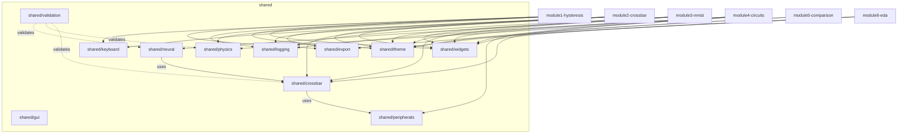

# Shared Refactor Plan — Single Source of Truth

> Make `shared/` the **only** source of truth for all reusable code.
> Every module (1–6) should **import from `shared/`** — never from another module.

---

## Lessons from Open-Source Tools

> [!IMPORTANT]
> This plan is informed by a deep code study of **15 production-grade open-source CIM/ferroelectric tools**. The architectural patterns below are directly derived from studying their source code.

### Key Architectural Patterns Discovered

| Pattern | Source Tool | Lesson for FeCIM |
|---------|-----------|------------------|
| **Interface-first core hierarchy** | CrossSim `ICore` → AnalogCore / BalancedCore / BitSlicedCore / OffsetCore / NumericCore | `shared/crossbar` should define a `CrossbarCore` interface with pluggable implementations (ideal, IR-drop, sneak-path, nonlinear) |
| **Device error model abstraction** | CrossSim `IDevice` → read_noise / programming_error / drift_error / apply_write_error | `shared/crossbar` should separate device physics (conductance quantization, drift, noise) from array-level simulation via a `DeviceModel` interface |
| **Circuit sub-blocks (ADC/DAC/Array)** | CrossSim `circuits/` → `IADC` (5 ADC types: SAR, ramp, pipeline, cyclic, quantizer) + `IArray` (4 array topologies) | `shared/peripherals` should adopt a similar `ADCModel` / `DACModel` interface hierarchy instead of the current monolithic implementation |
| **Clean solver pipeline** | badcrossbar: fill → KCL → solve → extract | `shared/crossbar` solver should follow this clean separation: build conductance matrix → apply KCL → sparse solve → extract currents/voltages |
| **Forward + inverse model** | Preisachmodel: `PreisachModel.__call__()` → `invert()` → inverse Everett function | `shared/physics` Preisach implementation should support both forward (input→output) and inverse (output→input) via Everett function |
| **YAML-driven material configs** | ferro_scripts: `bto_params.yaml`, `crca_params.yaml` | Material properties should be YAML/JSON configurable, not hardcoded — enables rapid switching between HfO₂, BaTiO₃, PZT, etc. |
| **Crossbar tiling + mapping** | MemTorch: Crossbar.py / Passive.py / Program.py / **Tile.py** (20KB) | Large weight matrices need tile-based crossbar mapping — `shared/crossbar` should include a `Tile` abstraction for partitioning |
| **Hardware-aware training loop** | IBM AIHWKIT: analog tile → rpucuda backend, noise injection per-MVM | `shared/neural` should support noise injection during inference (not just clean MVM) to match real hardware behavior |
| **Quantization strategy abstraction** | Brevitas: arbitrary bit-width QAT with per-layer/per-channel/per-tensor granularity | `shared/neural` quantization should be configurable (2–8 bit, symmetric/asymmetric, per-layer vs per-channel) |

---

## Current State (Analysis Summary)

| Metric | Value |
|:---|:---|
| Go module | `fecim-lattice-tools` (single `go.mod`) |
| Modules | 7 (`module1-hysteresis` … `module7-docs`) |
| `shared/` packages | 25 subdirectories, 361+ files |
| Shared tests | 174 test files |
| `shared/crossbar/` | ⚠️ **Empty** (only `logs/` dir) |

### Cross-Module Dependencies (Must Eliminate)

| Consumer | Imports from | Files affected |
|:---|:---|:---|
| **module3-mnist** | `module2-crossbar/pkg/crossbar` | **12 files** (gui, training, core, cmd) |
| **module4-circuits** | `module2-crossbar/pkg/crossbar` | **1 file** (`app.go` — `WriteDisturbEngine`) |
| module5-comparison | *(none found)* | — |

### Duplicated Files Across Modules

| File | Modules with copies | Shared version exists? |
|:---|:---|:---|
| `embedded.go` | **All 7** (M1–M7) | ❌ No |
| `keyboard.go` | **6** (M1–M6) | ✅ `shared/keyboard/` |
| `export.go` | **5** (M1, M3, M4, M5 + cmd) | ✅ `shared/export/` |
| `liveslide.go` | **3** (M2, M3, M5) | ❌ No (but `shared/widgets` has components) |
| `tooltips.go` | **2** (M2, M4) | ✅ `shared/widgets/tooltips.go` |
| `preset_provider.go` | **2** (M1, M2) | ❌ No |

### Local Widget Variants (Should Use `shared/widgets`)

| Widget | M1 | M2 | M3 | M4 | M5 | Shared |
|:---|:---|:---|:---|:---|:---|:---|
| ModeIndicator | local enums | `ModeIndicatorBox` | `MNISTModeIndicator` | — | — | `shared/widgets/mode_indicator.go` ✅ |
| EducationalPanel | slide labels | `*EducationalPanel` | `MNISTEducationalPanel` | — | — | `shared/widgets/educational_panel.go` ✅ |
| OperationLog | log labels | `*OperationLog` | `MNISTOperationLog` | — | — | `shared/widgets/operation_log.go` ✅ |
| KeyStat | — | `*KeyStatBox` | `MNISTKeyStat` | — | — | `shared/widgets/key_stat.go` ✅ |
| StatusBar | custom | shared | shared | — | — | `shared/widgets/status_helper.go` ✅ |

> M2 and M3 still define local wrappers instead of using shared.

---

## Refactoring Phases

### Phase 0 — Crossbar to Shared (Critical Path) ★

**Why first?** Module 3 (12 files) and Module 4 (1 file) import `module2-crossbar/pkg/crossbar` directly. This **cross-module dependency** must be broken before anything else.

`shared/crossbar/` exists but is effectively empty (only a `logs/` dir).

> [!IMPORTANT]
> **Inspired by CrossSim + badcrossbar architecture**: The migrated crossbar package should be restructured with clean interfaces, not just a copy-paste. CrossSim uses `ICore` → 5 implementations + `IDevice` → error models. badcrossbar uses a clean fill→KCL→solve→extract pipeline.

#### Steps

1. **Copy** `module2-crossbar/pkg/crossbar/*.go` → `shared/crossbar/`
   - 18 source files: `array.go`, `enhanced.go`, `irdrop.go`, `solver.go`, `solver_optimized.go`, `sneakpath.go`, `sneak_multihop.go`, `nonidealities.go`, `nonlinear_iv.go`, `drift.go`, `drift_calibration.go`, `fecap.go`, `temperature.go`, `temperature_profile.go`, `device_errors.go`, `write_disturb.go`, `demo_logging.go`, `gpu_mvm.go`
   - 65 test files
2. **Update package declaration** to `package crossbar` (should stay the same).
3. **Update all imports** project-wide:
   - Find: `"fecim-lattice-tools/module2-crossbar/pkg/crossbar"`
   - Replace: `"fecim-lattice-tools/shared/crossbar"`
4. **Verify**: `make test-xbar && make test-mnist && make test-circuits`
5. **Delete** `module2-crossbar/pkg/crossbar/` after all tests pass.
6. **Update** `module2-crossbar/pkg/gui/` imports to point to `shared/crossbar`.

#### Future Enhancement (Post-Migration): Interface Layer

After migration, introduce CrossSim-style interfaces *(Phase 0b, non-blocking)*:

```go
// shared/crossbar/core.go — inspired by CrossSim ICore
type CrossbarCore interface {
    SetMatrix(conductances [][]float64, opts ...Option)
    RunMVM(input []float64) []float64
    RunVMM(input []float64) []float64
    ReadMatrix() [][]float64
}

// shared/crossbar/device.go — inspired by CrossSim IDevice
type DeviceModel interface {
    ApplyWriteError(conductance float64) float64
    ReadNoise(conductance float64) float64
    ProgrammingError(conductance float64) float64
    DriftError(conductance float64, time float64) float64
    Levels() int                    // conductance quantization levels
    ConductanceRange() (min, max float64)
}

// shared/crossbar/solver.go — inspired by badcrossbar pipeline
type Solver interface {
    BuildConductanceMatrix(array *CrossbarArray) SparseMatrix  // fill
    ApplyKCL(g SparseMatrix, voltages []float64) SparseMatrix  // kcl
    Solve(g SparseMatrix, i []float64) []float64               // solve
    ExtractCurrents(voltages []float64, array *CrossbarArray) Solution  // extract
}
```

---

### Phase 1 — GUI Embedded Apps (All Modules)

Every module has an `embedded.go` that wraps the GUI `App` for the launcher. These should follow a shared interface.

#### Steps

1. **Create** `shared/gui/embedded_interface.go` with:
   ```go
   type EmbeddedApp interface {
       CreateEmbeddedContent() fyne.CanvasObject
       Name() string
       Icon() fyne.Resource
   }
   ```
2. **Refactor** each module's `embedded.go` to implement this interface.
3. **Move** common boilerplate (window setup, theme init) to `shared/gui/app_shell.go`.

---

### Phase 2 — Keyboard Shortcuts

6 modules have local `keyboard.go`. `shared/keyboard/keyboard.go` already exists.

#### Steps

1. **Audit** each module's keyboard handling for module-specific vs generic shortcuts.
2. **Extract** common shortcuts (?, Ctrl+E, Ctrl+Z, Escape) into `shared/keyboard/`.
3. **Update** modules to call `shared/keyboard.RegisterCommonShortcuts(window, handlers)`.
4. **Keep** module-specific shortcuts (e.g., M1's waveform toggles) in the module.

---

### Phase 3 — LiveSlide & Widget Consolidation

Modules 2, 3, and 5 have local `liveslide.go`. Modules 2 and 3 define local `ModeIndicator`, `EducationalPanel`, `OperationLog`, `KeyStat` wrappers.

#### Steps

1. **Delete** local `ModeIndicatorBox`, `EducationalPanel`, `OperationLog`, `KeyStatBox` from M2.
   - Replace with imports from `shared/widgets`.
2. **Delete** `MNISTModeIndicator`, `MNISTEducationalPanel`, `MNISTOperationLog`, `MNISTKeyStat` from M3.
   - Replace with imports from `shared/widgets`.
3. **Move** `liveslide.go` logic into `shared/widgets/liveslide.go` (create if not present).
4. **Verify**: `make test-xbar && make test-mnist`

---

### Phase 4 — Export Consolidation

5 modules have local `export.go`. `shared/export/export.go` already exists.

#### Steps

1. **Audit** each module's `export.go` for format-specific vs generic logic.
2. **Move** generic export utilities (CSV, JSON, image export) into `shared/export/`.
3. **Keep** module-specific export formats (e.g., SPICE netlist in M4) in the module.
4. **Update** modules to call `shared/export` for common operations.

---

### Phase 5 — Tooltips

M2 and M4 have local `tooltips.go`. `shared/widgets/tooltips.go` already exists (50KB, comprehensive).

#### Steps

1. **Move** module-specific tooltip content from M2/M4 into `shared/widgets/tooltips.go` (or a `shared/widgets/tooltip_content.go` registry).
2. **Delete** local `tooltips.go` from M2 and M4.
3. **Modules** register their tooltips at startup using a shared `RegisterTooltips()` API.

---

### Phase 6 — Preset Provider

M1 and M2 have local `preset_provider.go`. `shared/presets/` already exists.

#### Steps

1. **Move** preset provider logic to `shared/presets/provider.go`.
2. **Update** M1 and M2 to import from `shared/presets`.

---

### Phase 7 — Ferroelectric/Algorithm Core (Module 1 → Shared) ★

Module 1 has domain-specific packages that are already partially shared via `shared/physics/`.

> [!IMPORTANT]
> **Inspired by ferro_scripts + Preisachmodel + PFECAP**: The ferroelectric core should support:
> - **YAML-configurable material parameters** (like ferro_scripts' `bto_params.yaml`) — switch between HfO₂, BaTiO₃, PZT, CRCA without code changes
> - **Forward + inverse Preisach model** (like Preisachmodel's `invert()` method) — both forward (field→polarization) and inverse (polarization→field) via Everett function
> - **DFT data import** (like ferro_scripts' energy/chi data loading) — load ab-initio energy landscapes from external data files
> - **Landau coefficient extraction** (like ferro_scripts' `analyze_energy_chi()` → `landau_a, landau_b, landau_c`)

#### Current assets

- `module1/pkg/ferroelectric/`: `material.go`, `preisach.go`, `level_bins.go`, `render.go` — Material definitions and Preisach model
- `module1/pkg/algo/`: `calibration.go`, `doc.go` — Calibration manager
- `shared/physics/`: 101 files including `landau.go`, `ispp.go`, `material.go`, `calibration.go`

#### Steps

1. **Audit** overlap between `module1/pkg/ferroelectric/material.go` and `shared/physics/material.go`.
2. **Unify** material definitions into `shared/physics/material.go` (single source).
3. **Move** `preisach.go` to `shared/physics/preisach.go` if it doesn't already exist there.
4. **Move** `module1/pkg/algo/calibration.go` to `shared/physics/calibration.go` (or merge with existing).
5. **Update** M1 imports. **Delete** originals.

#### Future Enhancement: Material Config System

```go
// shared/physics/material_config.go — inspired by ferro_scripts YAML configs
type MaterialConfig struct {
    Name            string    `yaml:"name"`              // e.g. "HfO2", "BaTiO3"
    CellDims        [3]float64 `yaml:"cell_dims"`        // unit cell in Å
    RemnantPolarization float64 `yaml:"remnant_polarisation"` // µC/cm²
    CoerciveField   float64   `yaml:"coercive_field"`    // kV/cm
    LandauCoeffs    struct {
        A float64 `yaml:"a"`
        B float64 `yaml:"b"`
        C float64 `yaml:"c"`
    } `yaml:"landau_coefficients"`
    Symmetrize      bool      `yaml:"symmetrize"`
}

func LoadMaterial(path string) (*MaterialConfig, error)
func (m *MaterialConfig) ComputeBarrierHeight() float64  // ferro_scripts' analyze_energy_chi
func (m *MaterialConfig) GeneratePELoop(eMax, nSamples float64) []PEPoint  // ferro_scripts' get_pol_vs_e
```

---

### Phase 8 — Neural Network Core (Module 3 → Shared) ★

Module 3 has core neural network logic that could serve future modules.

> [!IMPORTANT]
> **Inspired by Brevitas + IBM AIHWKIT + CrossSim**:
> - **Configurable quantization** (like Brevitas' arbitrary bit-width QAT) — support 2–8 bit, symmetric/asymmetric, per-layer/per-channel
> - **Hardware-aware inference** (like IBM AIHWKIT) — inject device noise (read noise, programming error, drift) into MVM operations during inference
> - **Crossbar weight mapping** (like CrossSim/MemTorch `Tile.py`) — partition large weight matrices into crossbar-sized tiles with configurable overlap strategies

#### Current assets

- `module3/pkg/core/`: 12 files — `network.go`, `quantize.go`, `energy_model.go`, `cim_physics.go`, `interfaces.go`, `constants.go`, etc.
- `module3/pkg/training/`: `network.go`, `trainer`, `single_layer.go`
- `module3/pkg/mnist/`: Data loader

#### Steps

1. **Create** `shared/neural/` — Move `module3/pkg/core/*.go` here.
2. **Create** `shared/neural/training/` — Move reusable training logic.
3. **Keep** `module3/pkg/mnist/` in the module (MNIST-specific data loading).
4. **Update** M3 imports. **Verify**: `make test-mnist`

#### Future Enhancement: Quantization & Tile Mapping

```go
// shared/neural/quantize.go — inspired by Brevitas
type QuantizationConfig struct {
    Bits         int     // 2-8
    Symmetric    bool    // symmetric vs asymmetric
    Granularity  string  // "per_tensor", "per_channel", "per_layer"
    ScaleMethod  string  // "minmax", "percentile", "learned"
}

// shared/neural/tile.go — inspired by MemTorch Tile.py / CrossSim cores
type TileMapper struct {
    TileRows, TileCols int
    Overlap            int
    Core               crossbar.CrossbarCore  // plug in the crossbar simulator
}

func (tm *TileMapper) MapWeights(weights [][]float64) []Tile
func (tm *TileMapper) RunInference(tiles []Tile, input []float64) []float64
```

---

### Phase 9 — Peripheral Circuits Abstraction (NEW) ★

> [!IMPORTANT]
> **Inspired by CrossSim `circuits/`**: CrossSim separates peripherals into `IADC` (interface → 5 implementations: SAR, ramp, pipeline, cyclic, quantizer), `IDAC`, and `IArray` (4 array topologies). Current `shared/peripherals/` has implementations but **no interface abstraction**.

`shared/peripherals/` currently has: `adc.go` (17KB), `dac.go` (7KB), `charge_amplifier.go`, `chargepump.go`, `tia.go`, `noise.go`, `pvt.go`, `sample_hold.go`, `spice.go`, `voltage_regulator.go` — 31 files total.

#### Steps

1. **Create** `shared/peripherals/iadc.go` — ADC interface:
   ```go
   type ADCModel interface {
       Convert(analogValue float64) int         // analog → digital
       SetLimits(matrix [][]float64)            // calibrate range
       Bits() int
       Resolution() float64
       INL() float64                            // integral nonlinearity
       DNL() float64                            // differential nonlinearity
   }
   ```
2. **Refactor** existing `adc.go` to implement `ADCModel` as `FlashADC`.
3. **Add** `SarADC`, `PipelineADC` implementations (stubbed, informed by CrossSim's `sar_adc.py`, `pipeline_adc.py`).
4. **Create** `shared/peripherals/idac.go` — DAC interface.
5. **Refactor** Module 4 to use interfaces.

---

### Phase 10 — Validation & Cross-Tool Benchmarking (NEW) ★

> [!TIP]
> **Inspired by CrossSim/badcrossbar validation methodology**: CrossSim validates crossbar MVM against SPICE. badcrossbar provides exact nodal analysis for ground-truth comparison. These should be integrated as validation oracles.

#### Steps

1. **Create** `shared/validation/crossbar_oracle.go` — port badcrossbar's exact KCL solver as a reference implementation for validating the behavioral crossbar simulator.
2. **Create** `shared/validation/pe_loop_oracle.go` — port ferro_scripts' P-E loop generator as a reference for validating M1's hysteresis curves.
3. **Add** `validation/benchmarks/` — automated comparison tests:
   - Crossbar MVM accuracy vs badcrossbar exact solution at various array sizes
   - P-E loop shape vs ferro_scripts reference at various material parameters
   - Quantization error vs Brevitas reference at various bit widths

---

## Dependency Graph After Refactoring



> **Rule**: Arrows only point into `shared/`. No module imports from another module.

---

## Execution Order (Priority)

| # | Phase | Risk | Impact | Effort | New? |
|:---|:---|:---|:---|:---|:---|
| 0 | Crossbar → shared | **High** (18 files + 65 tests) | **Critical** — breaks M3→M2 dependency | ~2h | — |
| 0b | Crossbar interface layer | Low (additive) | High — enables pluggable device models | ~2h | ★ |
| 1 | Embedded interface | Low | Medium | ~1h | — |
| 2 | Keyboard | Low | Low | ~30m | — |
| 3 | LiveSlide + Widgets | Medium (API changes) | High (3 modules) | ~2h | — |
| 4 | Export | Low | Medium | ~1h | — |
| 5 | Tooltips | Low | Low | ~30m | — |
| 6 | Presets | Low | Low | ~20m | — |
| 7 | Ferroelectric core + YAML configs | Medium (physics overlap) | High — enables multi-material support | ~3h | ★ enhanced |
| 8 | Neural core + quantization | Medium | High — enables HW-aware inference | ~2h | ★ enhanced |
| 9 | Peripherals interface | Low (additive) | Medium — enables ADC/DAC plug-in arch | ~2h | ★ new |
| 10 | Validation & benchmarking | Low (additive) | High — correctness assurance | ~3h | ★ new |

---

## Open-Source Tool Integration Roadmap

Beyond refactoring, certain tools can be integrated as **external validation oracles** or **data sources**:

### Near-Term (During Refactoring)

| Tool | Integration Point | How |
|------|------------------|-----|
| `badcrossbar` | `shared/validation/crossbar_oracle.go` | Port exact nodal analysis as Go reference solver |
| `ferro_scripts` | `shared/physics/material_config.go` | Import YAML material parameter format |
| `Preisachmodel` | `shared/physics/preisach.go` | Port forward/inverse Preisach with Everett function |

### Medium-Term (Post-Refactoring)

| Tool | Integration Point | How |
|------|------------------|-----|
| `CrossSim` | Python validation scripts | Call CrossSim via `exec.Command` for GPU-accelerated MVM comparison |
| `ngspice` / `PySpice` | `shared/peripherals/spice.go` | Generate SPICE netlists for circuit-level validation |
| `Brevitas` | Python quantization scripts | Export quantized weights from Brevitas to Go inference engine |

### Long-Term (Feature Extensions)

| Tool | Feature | How |
|------|---------|-----|
| `IBM AIHWKIT` | Hardware-aware training | Python training script → export weights with noise profiles → Go inference |
| `OpenLane` | RTL-to-GDSII | Verilog export from M6 → OpenLane flow |
| `FerroX` | 3D device simulation | Python script → export device I-V curves → Go material model |

---

## Verification Plan

### Automated Tests

After each phase:

```bash
# Phase 0
make test-shared && make test-xbar && make test-mnist && make test-circuits

# Phase 1-6
make build && make test

# Phase 7
make test-shared && make test-hys

# Phase 8
make test-shared && make test-mnist

# Phase 9-10
make test-shared

# Final
make test-race
```

### Build Verification

```bash
go build ./...
go vet ./...
```

### Cross-Tool Validation (Phase 10)

```bash
# Run crossbar accuracy benchmark against badcrossbar reference
go test ./shared/validation/ -run TestCrossbarVsBadcrossbar -v

# Run P-E loop benchmark against ferro_scripts reference
go test ./shared/validation/ -run TestPELoopVsFerroScripts -v

# Run quantization accuracy benchmark
go test ./shared/validation/ -run TestQuantizationVsBrevitas -v
```

### Manual Verification

After all phases are complete:
1. Launch each module GUI individually and verify the main window renders
2. Check that keyboard shortcuts (?) work in each module
3. Verify export functionality in M1 and M2

---

## Rules Going Forward

1. **No cross-module imports.** Only `shared/` packages may be imported.
2. **New shared code gets tests.** If moving code to shared, move or add tests.
3. **Single `go.mod`.** Continue using the mono-module structure.
4. **Package naming.** `shared/<domain>/` (e.g., `shared/crossbar`, `shared/neural`, `shared/physics`).
5. **Interface-first design.** New shared packages should define interfaces before implementations (CrossSim pattern).
6. **YAML-configurable parameters.** Domain-specific constants (material properties, device parameters, quantization configs) should be loadable from YAML/JSON config files, not hardcoded.
7. **Validation oracles.** Every physics/math module should have a reference implementation (ported from an open-source tool) for correctness testing.
